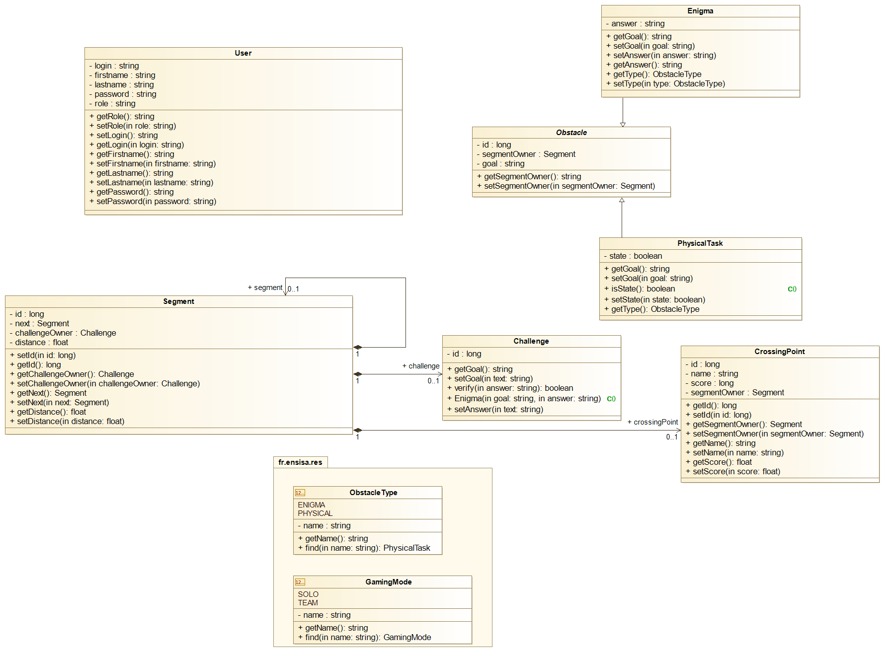

## Welcome to **FitnessChallenge**

## Java EE Application for Developers

It is an application that allows you to run a race in a virtual world. In order to progress in the virtual race, it is necessary to run or cycle in the real world, but also to solve riddles or challenges in order to overcome certain obstacles that will arise on the road.

## Features


## Plateforms

FitnessChallenge is Web Platform developed with Eclipse IDE and compatible with all platforms.

## Material Design

*  [`IntelliJ IDEA Community & Ultimate Edition 2020.3.1`](https://www.jetbrains.com/fr-fr/idea/)
*  [`Eclipse IDE For Java Developer 2020-12`](https://www.eclipse.org/)
*  [`Apache NetBeans IDE 12.2`](https://fr.netbeans.org/)
*  [`Payara Plateform Community Edition`](https://www.payara.fish/)


## Requirements

FitnessChallenge is designed too have fairly minimal requirements to build and use with your projects, but there are somes. If you notice any problems on your platform, please notify [`Hethsron Jedaël BOUEYA`](mailto:hetshron-jeadel.boueya@uha.fr) or [`Omar CHICHAOUI`](mailto:omar.chichaoui@uha.fr) or [`Pranamika SOLANKI`](mailto:pranamika.solanki@uha.fr). Patches and fixing them for welcome !

## Development
For developement, before running the application, you need to clone this project on your local repository, open it with Android Studio and Build Apps as follows :

1. Clone the `FitnessChallenge` repo locally :

    ```console
        $ https://github.com/Winssench/FitnessChallenge.git
    ```

2. Open this project with Eclipse IDE

3. Run the application server [`Payara`](https://www.payara.fish/) by opening a terminal and executing the following command to start it :

    ```console
        $ asadmin start-domain
    ```

   To verify that you are running the application server, open a browser and go to [`http://localhost:4848`](http://localhost:4848) to display the Payara server console.

   Notice : To stop your application server, open a terminal and execute the following command :

    ```console
        $ asadmin stop-domain
    ```

4. For Windows users, install MySQL Server from this [`link`](https://dev.mysql.com/doc/mysql-windows-excerpt/8.0/en/windows-installation.html). For GNU/Linux users, execute this command :
    
    Debian Like Systems
    ```console
        $ sudo apt-get install mysql-server -y
    ```
    
    Red-Hat Systems
    ```console
        $ sudo yum install @mysql -y
    ```
   
    Arch-Linux Systems
    ```console
        $ sudo pacman -Syy mariadb
    ```
   
5. Add MySQL Connector for Java Application you've downloaded in Payara by using this command :

    ```console
        $ asadmin add-library mysql-connector-java-8.0.23.jar
    ```
   
    To verify, that the connector has been loaded correctly, execute this command :

    ```console
        $ asadmin list-libraries
    ```
   
6. Create a JDBC Connection Pool to MySQL Server by using this command :

    ```console
        $ asadmin create-jdbc-connection-pool --ping --restype javax.sql.DataSource --datasourceclassname com.mysql.cj.jdbc.MysqlDataSource --property user=root:password=xxx:DatabaseName=rvm_jsf:ServerName=127.0.0.1:port=3306:useSSL=false:allowPublicKeyRetrieval=true:zeroDateTimeBehavior=CONVERT_TO_NULL:useUnicode=true:serverTimezone=UTC:characterEncoding=UTF-8:useInformationSchema=true:nullCatalogMeansCurrent=true:nullNamePatternMatchesAll=false mysqlpool
    ```

   If everything goes without error then you can deploy the application from your IDE on your server, if not, recreate the JDBC POOL.

7. Launch this project locally on your [`Payara Server 5.2020.7`](https://www.payara.fish/downloads/payara-platform-community-edition/)

## Usage

## Model



### Command-Line interface
When you use [`Postman Desktop Agent`](https://www.postman.com/) to send requests and receive responses through our REST API :

## Bug Fixed

Eclipse is an IDE that sometimes has bugs. Not having been spared by this, we encountered a bug that we solved by creating a new table by hand. As an example, if this happens, we recommend using the following command:

   ```console
        $ create table toto(ID int NOT NULL AUTO_INCREMENT, ROLE varchar(255) NOT NULL, OWNERROLE_LOGIN varchar(255) , PRIMARY KEY (ID));
   ````